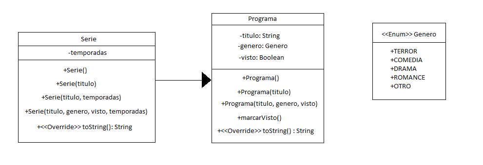

# Programación orientada a objetos en Kotlin

Este código ejemplifica la programación orientada a objetos en [Kotlin] El codigo cuenta con las clase _Serie_, la cual extiende a la clase _Programa_, además de la enumeración _Genero_. Los métodos y atributos de cada clase se muestran a continuación en el diagrama de clases:

Estos códigos se realizaron como parte del [Curso básico de Kotlin para Android: Fundamentos de 0 a 100].

[Kotlin]: <https://kotlinlang.org/>
[Curso básico de Kotlin para Android: Fundamentos de 0 a 100]: <https://www.udemy.com/course/fundamentos-de-kotlin-android/>
